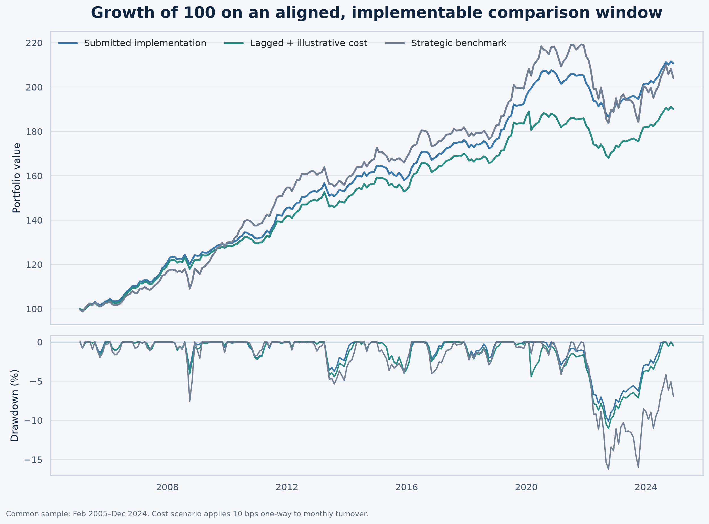
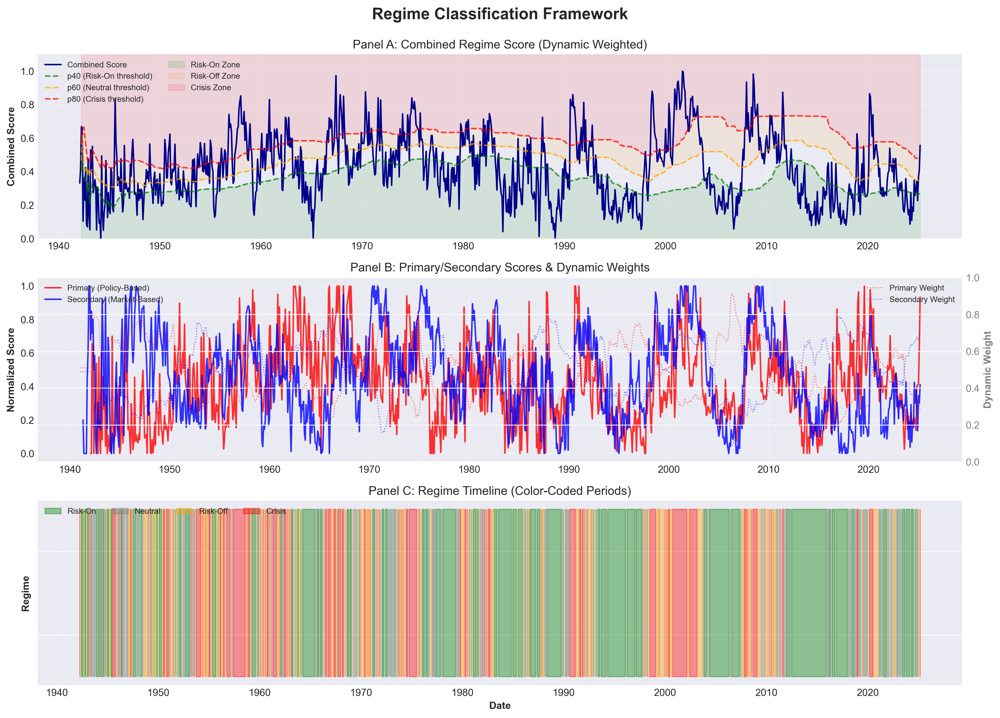
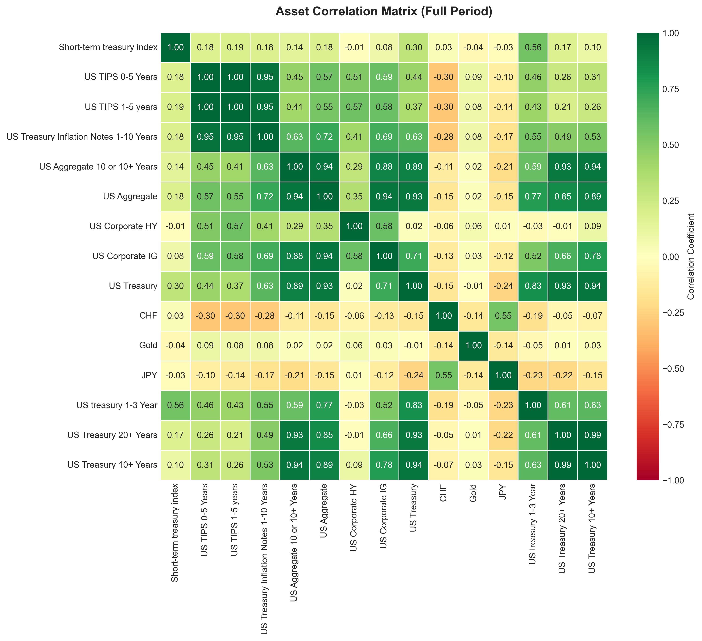
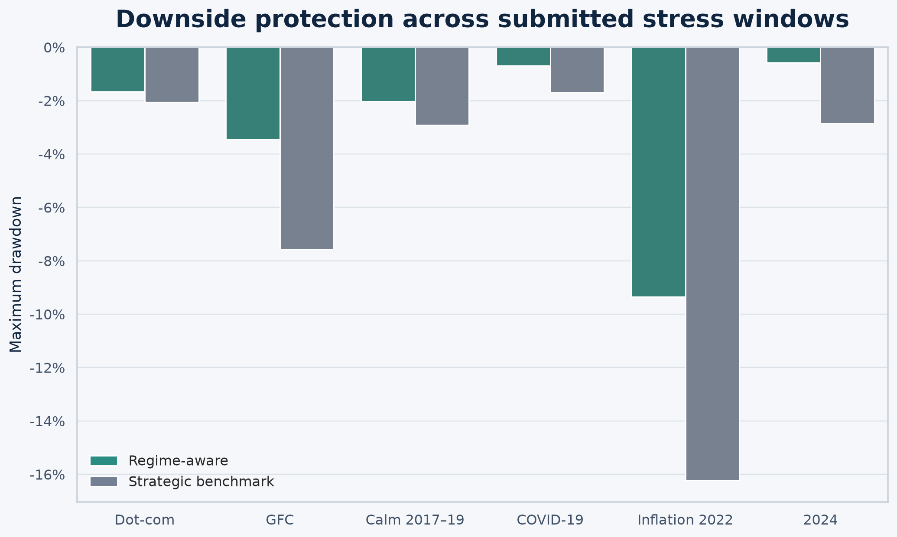

# Regime-Aware Fixed-Income Allocation Framework

A capital-preservation-oriented asset-allocation framework that translates macroeconomic conditions and market stress into dynamic fixed-income portfolio weights.

**[Open the project page](docs/index.html)** · **[View the full team presentation](docs/assets/team-presentation.pdf)**

## Project overview

This project was developed by a five-person student team for a Union Investment company project at Frankfurt School of Finance & Management. The brief called for a transparent allocation process that could respond to changing market regimes while prioritising downside protection.

The framework combines:

- policy and macroeconomic indicators;
- market-stress signals;
- four interpretable regimes: Risk-On, Neutral, Risk-Off, and Crisis;
- rule-based allocations across investment-grade credit, government bonds, inflation-linked bonds, cash, high yield, gold, and defensive currencies; and
- drawdown and volatility controls intended to reduce risk in stressed conditions.

## Why the project matters

Traditional strategic asset allocation can be slow to react when inflation, monetary policy, and financial stress change together. This project explores whether an explainable regime engine can adapt exposures without relying on an opaque forecasting model.

The main design principle is simple: take more credit risk when conditions are supportive, and rotate toward government bonds, cash, and diversifiers as stress rises.


The average allocations show the intended behaviour clearly. Risk-On periods carry the largest investment-grade and high-yield exposure, while Crisis periods move heavily toward cash and government bonds.

## Methodology

1. **Prepare the indicator set.** Monthly macro, policy, volatility, liquidity, and geopolitical variables are aligned and transformed.
2. **Classify regimes.** Policy conditions and market stress are combined into four interpretable states.
3. **Map regimes to base allocations.** Each state has a transparent asset-class allocation template.
4. **Apply risk controls.** Volatility, drawdown, correlation, and tail-risk adjustments modify the base portfolio.
5. **Compare with strategic allocation.** The dynamic portfolio is evaluated against a static fixed-income benchmark.

The submitted notebook contains the original end-to-end implementation and the outputs used for the academic presentation.

## Results

### Results reported in the submitted project

| Portfolio | Annualised return | Annualised volatility | Return/volatility ratio | Maximum drawdown |
|---|---:|---:|---:|---:|
| Regime-aware strategy | 5.89% | 3.11% | 1.89 | -10.10% |
| Strategic allocation benchmark | 5.18% | 4.85% | 1.07 | -16.23% |

These are the figures produced by the submitted implementation over its broad historical sample. The original output labels the return/volatility ratio as a “Sharpe Ratio”; because no risk-free rate is deducted in that calculation, it is described more precisely here as a return/volatility ratio.

### Conservative post-submission audit

To test how sensitive the headline result is to implementation choices, a separate audit applies a one-month delay to the signal weights, uses a common February 2005–December 2024 sample with complete asset coverage, and adds an illustrative 10-basis-point one-way trading cost.

| Portfolio | Annualised return | Annualised volatility | Return/volatility ratio | Excess-return Sharpe* | Maximum drawdown |
|---|---:|---:|---:|---:|---:|
| Published implementation, common sample | 3.79% | 3.03% | 1.25 | 0.69 | -10.10% |
| Lagged strategy | 3.36% | 3.31% | 1.01 | 0.49 | -10.86% |
| Lagged strategy after illustrative costs | 3.28% | 3.31% | 0.99 | 0.47 | -11.05% |
| Strategic allocation benchmark | 3.71% | 4.94% | 0.75 | 0.40 | -16.23% |

\*Excess returns are measured over the short-term Treasury index used as a cash proxy in the submitted data.

The stricter test reduces the headline performance, but the capital-preservation result remains visible: the lagged strategy exhibits materially lower volatility and a shallower maximum drawdown than the static benchmark over the common sample.



## Visual analysis

### Regime-classification framework



The combined regime score blends policy and market-based components. The historical timeline also shows that classifications can change frequently, so the output is best treated as a responsive state indicator rather than a persistent macro forecast.

### Asset correlation matrix



### Historical stress windows



### Performance by classified regime


## Repository contents

```text
.
├── Union_Investment_Asset_Allocation_Engine.ipynb  # original submitted notebook
├── audit/
│   └── conservative_backtest_audit.py              # lagged/common-sample review
├── data/
│   └── README.md                                    # data provenance and access notes
├── docs/
│   ├── index.html                                    # GitHub Pages project page
│   └── assets/                                       # charts and private-review PDFs
├── results/
│   └── tables/
├── .gitignore
└── requirements.txt
```

## Reproducing the analysis

The raw input files are not included because parts of the dataset were obtained through licensed or restricted sources. If you have authorised access:

1. Place `Asset Data.xlsx`, `master_indicators_dataset_monthly.csv`, and `master_indicators_dataset_processed.csv` in the repository root.
2. Install the packages listed in `requirements.txt`.
3. Run `Union_Investment_Asset_Allocation_Engine.ipynb` from the repository root.
4. Run `python audit/conservative_backtest_audit.py` to reproduce the stricter comparison table.

The notebook uses the file layout of the original submission. It is preserved as submitted rather than silently rewritten after the fact.

## Limitations

- The submitted implementation applies contemporaneous regime and risk-control information to same-month returns. The audit therefore reports a one-month-lagged version.
- Some indicators use full-sample thresholds, which can introduce look-ahead bias.
- Asset histories begin on different dates; broad-sample figures do not use an identical opportunity set in every month.
- Transaction costs, taxes, market impact, and operational constraints were not part of the submitted backtest.
- The quantitative comparison portfolios in the notebook are exploratory in-sample references, not investable out-of-sample benchmarks.
- Regime classifications can change frequently and should not be interpreted as stable forecasts.

## Disclaimer

This repository documents an academic project. It is not investment advice, a production trading system, or an official publication or endorsement by Union Investment or Frankfurt School of Finance & Management.
