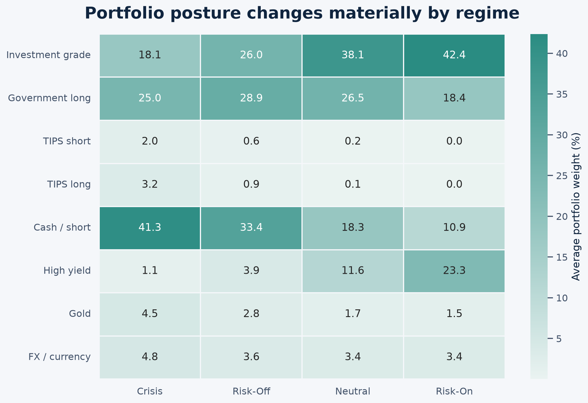

# Regime-Aware Fixed-Income Allocation

A dynamic, regime-aware fixed-income allocation framework that adapts to changing macroeconomic, market, and geopolitical conditions.

**[Explore the full case study](docs/index.html)** · **[View the presentation](docs/assets/team-presentation.pdf)**

## Overview

The framework combines policy, macroeconomic, and market-stress indicators to classify four market regimes: **Risk-On, Neutral, Risk-Off, and Crisis**. Each regime maps to a transparent allocation across government bonds, investment-grade and high-yield credit, inflation-linked bonds, cash, gold, and defensive currencies.

The objective is practical: participate when conditions are supportive and shift toward capital preservation as risk rises.

## Framework

- Combine policy-based and market-based signals into a dynamic regime score.
- Translate the score into four interpretable market states.
- Map each state to rule-based asset-class weights.
- Apply volatility, drawdown, correlation, and tail-risk controls.
- Compare the dynamic portfolio with a strategic fixed-income allocation.

## Results

| Portfolio | Annualised return | Volatility | Return / volatility | Maximum drawdown |
|---|---:|---:|---:|---:|
| Regime-aware | 5.89% | 3.11% | 1.89 | -10.10% |
| Strategic allocation | 5.18% | 4.85% | 1.07 | -16.23% |

The [project page](docs/index.html) contains the methodology, regime thresholds, asset-allocation tables, historical test periods, implementation audit, and complete presentation.

## Repository contents

- `Union_Investment_Asset_Allocation_Engine.ipynb` — end-to-end research notebook
- `docs/` — visual case study and GitHub Pages site
- `results/tables/` — performance and allocation tables
- `audit/` — conservative lagged implementation check
- `data/README.md` — data coverage and access notes

## Data note

Raw input files are not included because parts of the dataset were obtained through licensed or restricted sources. The repository includes the notebook, derived results, charts, and documentation needed to review the framework.

## Disclaimer

This repository documents an academic research project. It is not investment advice or a production trading system.
